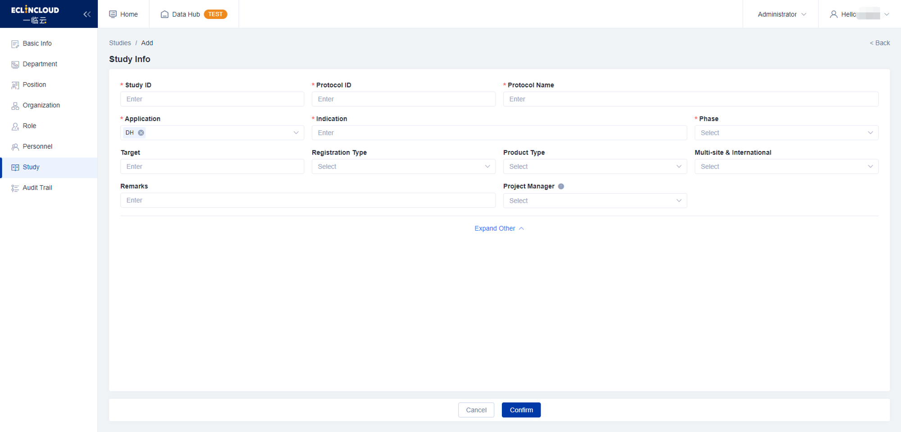

# Add Study

### Add Study

1. Go to **`Study`**.
2. Click **`+ Add`**.
3. Complete the study info, then click **`Confirm`**.

<figure><figcaption></figcaption></figure>


Note: You can customize the authorized application(s) for each study.


